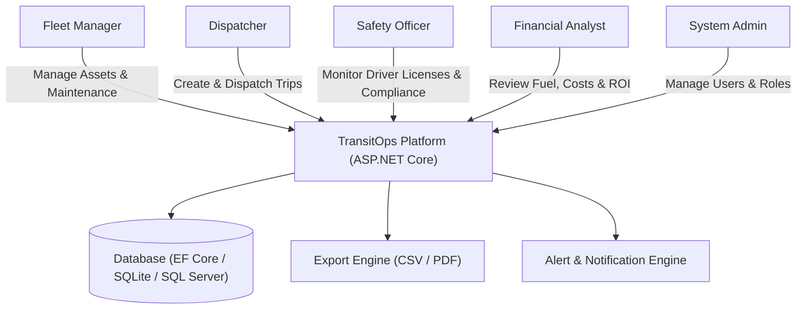
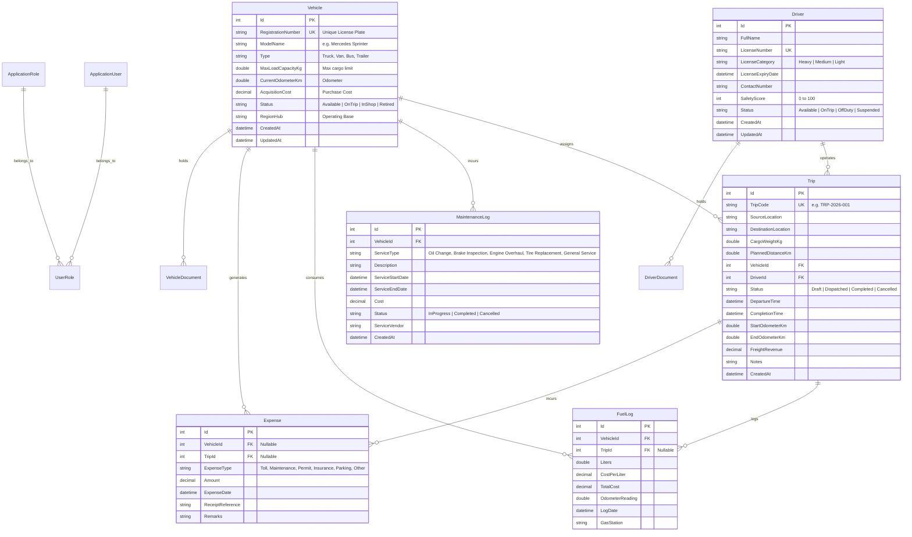
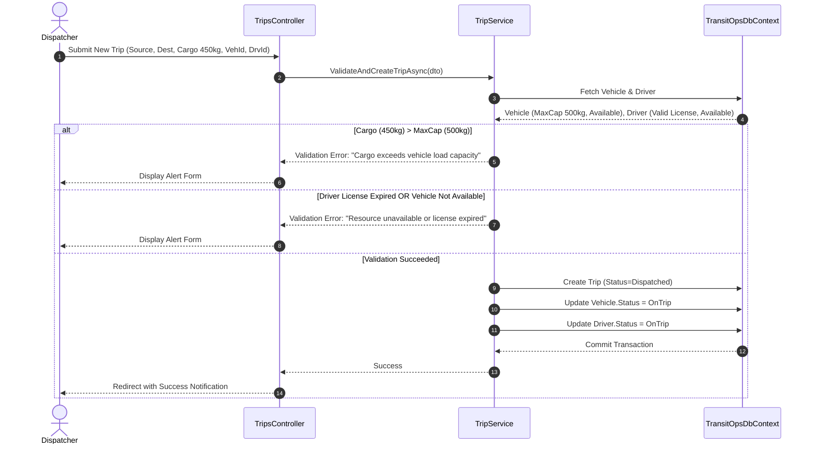

# Software Requirements Specification (SRS)
## Project: TransitOps – Smart Transport Operations Platform

**Document Version:** 1.0  
**Target Platform:** ASP.NET Core (.NET 10) Web Application  
**Author / Engineering Team:** Antigravity Team  
**Date:** 2026-08-10  

---

## 1. Introduction

### 1.1 Purpose
This document provides a comprehensive Software Requirements Specification (SRS) for **TransitOps**, a centralized smart transport operations management platform. The purpose of TransitOps is to digitize and automate the end-to-end lifecycle of fleet vehicles, driver compliance, trip dispatching, scheduled maintenance, fuel and expense logging, and business analytics.

### 1.2 Scope of the System
TransitOps addresses the operational inefficiencies caused by spreadsheet tracking and disconnected logbooks. The platform enforces strict business rules around capacity constraints, vehicle and driver availability, driver licensing compliance, automatic operational state transitions, and real-time financial and operational metrics.

### 1.3 Target Audience & User Roles
1. **Fleet Manager**: Oversees fleet assets, vehicle lifecycle, maintenance schedules, and operational health.
2. **Dispatcher / Operations**: Manages trip creation, vehicle/driver assignment, dispatch execution, and trip completion tracking.
3. **Safety Officer**: Audits driver licenses, monitors license validity and expirations, tracks safety scores, and manages driver status.
4. **Financial Analyst**: Audits operating costs, fuel expenditure, maintenance expenses, per-vehicle ROI, and exports analytical reports.
5. **System Administrator**: Manages system users, role-based access control (RBAC), and global configurations.

---

## 2. Overall Description

### 2.1 System Context Diagram

### 2.2 System Architecture Overview

TransitOps is built following Clean Architecture principles on **ASP.NET Core 10**:
- **Presentation Layer**: ASP.NET Core MVC with Razor Views, modern Vanilla CSS/JS design system (Stripe-inspired minimal white theme, responsive grid), and Chart.js telemetry dashboards.
- **Application & Service Layer**: Encapsulates business logic, validation rules, state machine transitions, and KPI calculation formulas.
- **Domain Layer**: Core entities (`Vehicle`, `Driver`, `Trip`, `MaintenanceLog`, `FuelLog`, `Expense`), Enums, and Value Objects.
- **Infrastructure Layer**: Entity Framework Core with DbContext, identity store, SQLite/SQL Server providers, and document/export services.

---

## 3. Detailed Data Models & ER Diagram

### 3.1 Entity Relationship Diagram

---

## 4. Functional Requirements

### 4.1 Authentication & Role-Based Access Control (RBAC)
- **FR-AUTH-1**: User authentication via email and secure password hashing using ASP.NET Core Identity.
- **FR-AUTH-2**: System shall support 5 standard roles: `FleetManager`, `Dispatcher`, `SafetyOfficer`, `FinancialAnalyst`, `Admin`.
- **FR-AUTH-3**: Unauthenticated requests redirect to the login portal.
- **FR-AUTH-4**: Unauthorized role access returns HTTP 403 Forbidden with user-friendly error views.

| Role | Vehicle CRUD | Driver CRUD | Trip Dispatch | Maintenance CRUD | Fuel & Expenses | Reports & Analytics | User Admin |
|---|---|---|---|---|---|---|---|
| **Admin** | Full | Full | Full | Full | Full | Full | Full |
| **Fleet Manager** | Full | View | View | Full | View | View | None |
| **Dispatcher** | View | View | Full | View | Log Trip Fuel/Expense | View | None |
| **Safety Officer** | View | Full (Edit Status/License) | View | View | None | View | None |
| **Financial Analyst** | View | View | View | View | Full | Full (Export CSV/PDF) | None |

### 4.2 Vehicle Registry
- **FR-VEH-1**: Record vehicle attributes: Registration Number (must be globally unique), Model/Make, Vehicle Type (`Truck`, `Van`, `Bus`, `Trailer`), Max Load Capacity (kg), Current Odometer (km), Acquisition Cost, Region/Hub, and Status.
- **FR-VEH-2**: Allowed Vehicle Statuses:
  - `Available`: Ready for trip dispatch or scheduled maintenance.
  - `OnTrip`: Currently deployed on an active trip.
  - `InShop`: Under active maintenance.
  - `Retired`: Decommissioned from the fleet (cannot be dispatched or reactivated).
- **FR-VEH-3**: Search, filter by type/status/region, and sort vehicle registry.
- **FR-VEH-4**: Document attachment management (Registration Certificate, Insurance Policy, Fitness Certificate).

### 4.3 Driver Management
- **FR-DRV-1**: Driver profiles containing Full Name, License Number (globally unique), License Category (`Heavy`, `Medium`, `Light`), License Expiry Date, Contact Number, Safety Score (0–100), and Status.
- **FR-DRV-2**: Allowed Driver Statuses:
  - `Available`: Eligible for trip dispatch.
  - `OnTrip`: Currently driving an active trip.
  - `OffDuty`: Unavailable for dispatch due to rest or shift off.
  - `Suspended`: Ineligible for dispatch due to compliance/safety violation.
- **FR-DRV-3**: Visual indicators and automated alert center for expiring licenses ($\le 30$ days) and expired licenses.

### 4.4 Trip Management & Validation Engine
- **FR-TRP-1**: Trip creation requires: Source Location, Destination Location, Cargo Weight (kg), Planned Distance (km), Estimated Revenue, Assigned Vehicle, Assigned Driver.
- **FR-TRP-2**: Trip Lifecycle: `Draft` $\rightarrow$ `Dispatched` $\rightarrow$ `Completed` or `Cancelled`.
- **FR-TRP-3**: Mandatory Validation Rules before Dispatch:
  1. Selected Vehicle status must be strictly `Available`.
  2. Selected Driver status must be strictly `Available`.
  3. Cargo Weight $(\text{kg}) \le \text{Vehicle Maximum Load Capacity } (\text{kg})$.
  4. Driver License Expiry Date must be $> \text{Current Date}$.
  5. Driver Status must not be `Suspended` or `OffDuty`.
- **FR-TRP-4**: Dispatched Trip State Transition:
  - System automatically transitions Vehicle status to `OnTrip`.
  - System automatically transitions Driver status to `OnTrip`.
  - System locks the starting odometer reading.
- **FR-TRP-5**: Trip Completion:
  - User submits Final Odometer (km), Actual Fuel Consumed (L), and Freight Revenue.
  - Validation: $\text{Final Odometer} \ge \text{Start Odometer}$.
  - System automatically marks Trip as `Completed`.
  - System automatically transitions Vehicle status back to `Available`.
  - System automatically transitions Driver status back to `Available`.
  - System automatically updates Vehicle Current Odometer.
  - System automatically creates corresponding `FuelLog` entry linked to the Trip and Vehicle.
- **FR-TRP-6**: Trip Cancellation:
  - If a `Dispatched` trip is cancelled, system immediately reverts Vehicle and Driver to `Available`.

### 4.5 Maintenance Workflow
- **FR-MNT-1**: Maintenance logs include: Vehicle, Service Type (`Oil Change`, `Brake Inspection`, `Engine Overhaul`, `Tire Replacement`, `General Service`), Description, Start Date, End Date, Cost, Service Vendor, and Status (`InProgress`, `Completed`).
- **FR-MNT-2**: When an active maintenance log is initiated (`InProgress`), system automatically sets Vehicle Status to `InShop`.
- **FR-MNT-3**: While `InShop`, the vehicle is strictly hidden and blocked from the Dispatcher's vehicle selection pool.
- **FR-MNT-4**: When the maintenance log is closed (`Completed`), system automatically restores Vehicle Status to `Available` (unless the vehicle has been marked `Retired`).
- **FR-MNT-5**: The maintenance cost is automatically logged into the vehicle's total operational expense ledger.

### 4.6 Fuel & Expense Management
- **FR-EXP-1**: Direct recording of fuel logs (Liters, Cost per Liter, Total Cost, Date, Odometer reading, Station name).
- **FR-EXP-2**: Direct recording of miscellaneous operational expenses (Toll fees, Maintenance fees, Permits, Insurance, Parking).
- **FR-EXP-3**: Automated aggregate calculation of Total Operating Cost per Vehicle:
$$\text{Total Operational Cost} = \sum \text{Fuel Costs} + \sum \text{Maintenance Costs} + \sum \text{Other Expenses}$$

### 4.7 Executive Dashboard & Analytics
- **FR-DSH-1**: Top Metric KPI Cards:
  - **Active Vehicles**: Count of vehicles currently `OnTrip`.
  - **Available Vehicles**: Count of vehicles ready for dispatch (`Available`).
  - **Vehicles in Maintenance**: Count of vehicles currently `InShop`.
  - **Active Trips**: Count of trips with status `Dispatched`.
  - **Pending Trips**: Count of trips with status `Draft`.
  - **Drivers On Duty**: Count of drivers currently `OnTrip` or `Available`.
  - **Fleet Utilization Rate (%)**:
    $$\text{Fleet Utilization (\%)} = \left( \frac{\text{Vehicles on Trip}}{\text{Total Fleet Count} - \text{Retired Vehicles}} \right) \times 100$$
- **FR-DSH-2**: Global Filters: Filter dashboard KPIs and charts dynamically by Vehicle Type (`Truck`, `Van`, `Bus`), Status, and Region/Hub.
- **FR-DSH-3**: Analytics & Financial Metrics:
  - **Fuel Efficiency (km/L)**:
    $$\text{Fuel Efficiency} = \frac{\text{Total Distance Traveled (km)}}{\text{Total Fuel Consumed (Liters)}}$$
  - **Vehicle ROI (%)**:
    $$\text{Vehicle ROI (\%)} = \left( \frac{\text{Freight Revenue} - (\text{Maintenance Cost} + \text{Fuel Cost})}{\text{Vehicle Acquisition Cost}} \right) \times 100$$
- **FR-DSH-4**: Interactive Charts:
  - Monthly operational cost trends (Fuel vs. Maintenance vs. Tolls).
  - Fleet status distribution doughnut chart.
  - Driver safety score distribution.
- **FR-DSH-5**: Data Exporting:
  - Complete export of reports and trip data to **CSV** format.
  - Formatted, printable **PDF** summary report generation.

---

## 5. Non-Functional Requirements

### 5.1 Performance & Scalability
- Sub-200ms server response time for all standard CRUD operations.
- Optimized EF Core queries with `.AsNoTracking()` on read-only queries and indexed foreign keys/registration numbers.

### 5.2 Security & Integrity
- Passwords hashed with standard PBKDF2 with HMAC-SHA512.
- Anti-forgery tokens (CSRF protection) enabled on all form posts.
- Input validation on both client (HTML5/JS) and server (Data Annotations & Service layer).
- Transactional consistency using EF Core database transactions during dual-entity state transitions (e.g., Trip dispatch updating Trip + Vehicle + Driver).

### 5.3 User Experience & Design
- Sleek, modern minimal white theme (Stripe-inspired) with clean cards and intuitive color-coded status badges:
  - `Available` (Green / Emerald)
  - `OnTrip` (Blue / Cyan)
  - `InShop` (Amber / Orange)
  - `Retired` / `Suspended` (Crimson / Red)
- Fully responsive across desktop, tablet, and mobile screens.

---

## 6. Verification & Test Matrix

| Test ID | Scenario | Expected Outcome |
|---|---|---|
| **TC-01** | Register vehicle with duplicate registration number | System rejects with unique constraint validation error |
| **TC-02** | Create trip with cargo 600kg on vehicle with max cap 500kg | System blocks dispatch and displays overload alert |
| **TC-03** | Dispatch trip with driver whose license expired yesterday | System blocks dispatch and displays license expired error |
| **TC-04** | Dispatch valid trip (Van-05, Alex, 450kg $\le$ 500kg) | Trip status becomes `Dispatched`; Van-05 and Alex status become `OnTrip` |
| **TC-05** | Complete dispatched trip with final odometer | Trip status becomes `Completed`; Van-05 and Alex restored to `Available`; Odometer updated |
| **TC-06** | Create active maintenance log for Van-05 | Van-05 status becomes `InShop`; Van-05 disappears from trip dispatch dropdown |
| **TC-07** | Mark maintenance log as completed | Van-05 status restored to `Available` and reappears in trip dispatch dropdown |
| **TC-08** | Verify dashboard Fleet Utilization & ROI calculation | Calculations precisely match domain mathematical formulas |
| **TC-09** | Export analytics report to CSV / PDF | File downloads successfully with complete dataset |
