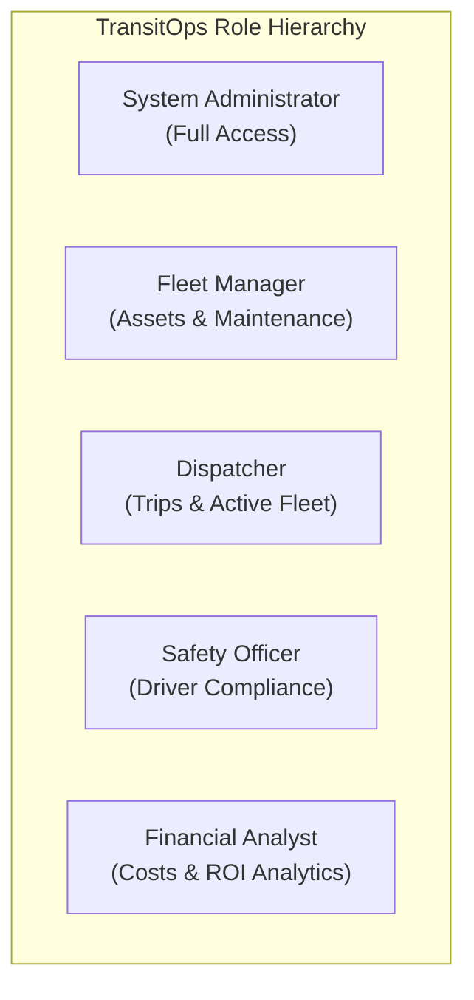

# User Roles and Permissions Specification
## Project: TransitOps – Smart Transport Operations Platform

**Document Version:** 1.0  
**Target Platform:** ASP.NET Core Identity RBAC  
**Status:** Approved Specification  

---

## 1. Overview
TransitOps implements a granular Role-Based Access Control (RBAC) model. Each user in the system is assigned one or more standard roles that define their navigational visibility, read/write/edit permissions, and access to operational state actions (e.g. dispatching trips, putting vehicles in maintenance, logging expenses).

---

## 2. Defined Roles & Personas

### 2.1 Role 1: Fleet Manager (`FleetManager`)
- **Primary Responsibility**: Overseeing physical fleet assets, lifecycle management, preventive maintenance schedules, vehicle retirements, and operational efficiency.
- **Allowed Actions**:
  - Full CRUD on Vehicles (Add, Edit, View, Retire).
  - Full CRUD on Maintenance Logs (Create Work Order, Update, Mark Completed).
  - View Drivers, Trips, Fuel, and Expense logs.
  - View Fleet health metrics and utilization dashboards.
- **Restricted Actions**:
  - Cannot dispatch trips directly.
  - Cannot modify driver safety scores or suspend driver licenses.
  - Cannot modify system user accounts.

### 2.2 Role 2: Dispatcher (`Dispatcher`)
- **Primary Responsibility**: Planning, creating, validating, dispatching, and monitoring active delivery trips.
- **Allowed Actions**:
  - Full CRUD on Trips (`Draft` $\rightarrow$ `Dispatched` $\rightarrow$ `Completed` / `Cancelled`).
  - View Available Vehicles and Available Drivers.
  - Record Trip-specific final odometer and fuel consumption upon trip completion.
  - View active trips and vehicle assignments for operational monitoring.
- **Restricted Actions**:
  - Cannot add or retire vehicles in the master registry.
  - Cannot initiate or close maintenance work orders.
  - Cannot edit driver compliance or license status.

### 2.3 Role 3: Safety Officer (`SafetyOfficer`)
- **Primary Responsibility**: Ensuring driver legal compliance, verifying driving license categories, monitoring safety scores, auditing compliance logs, and handling suspensions.
- **Allowed Actions**:
  - Full CRUD on Drivers (Add, Edit, Update License Info, Suspend / Reinstate).
  - View Driver License Expiration alerts ($<30$ days warning center).
  - Manage and adjust Driver Safety Scores.
  - View active trips and vehicle assignments for compliance verification.
- **Restricted Actions**:
  - Cannot dispatch or modify trips.
  - Cannot create or modify vehicle maintenance records.
  - Cannot edit fuel or expense ledgers.

### 2.4 Role 4: Financial Analyst (`FinancialAnalyst`)
- **Primary Responsibility**: Auditing operating expenditures (Fuel, Maintenance, Tolls, Insurance), tracking revenue from freight trips, computing per-vehicle ROI, and generating CSV/PDF export reports.
- **Allowed Actions**:
  - Full CRUD on Fuel Logs and Operating Expenses.
  - View all Vehicles, Trips, and Maintenance financial costs.
  - Access Executive Financial Analytics, Cost-per-KM metrics, and Vehicle ROI analytics.
  - Export CSV and PDF analytical and audit reports.
- **Restricted Actions**:
  - Cannot dispatch trips.
  - Cannot edit vehicle or driver operational statuses.

### 2.5 Role 5: System Administrator (`Admin`)
- **Primary Responsibility**: System provisioning, user account creation, assigning roles, audit log inspection, and global configuration.
- **Allowed Actions**:
  - Superuser access across all modules, CRUD on all entities, and User Management.

---

## 3. Comprehensive RBAC Matrix

| Feature / Action | Admin | Fleet Manager | Dispatcher | Safety Officer | Financial Analyst |
|---|:---:|:---:|:---:|:---:|:---:|
| **Dashboard & KPIs** |
| View General Operations Dashboard | ✅ | ✅ | ✅ | ✅ | ✅ |
| View Financial ROI & Cost Widgets | ✅ | ✅ | ❌ | ❌ | ✅ |
| View Driver Safety & Compliance Widgets | ✅ | ❌ | ❌ | ✅ | ❌ |
| **Vehicle Master Registry** |
| View Vehicle Master List | ✅ | ✅ | ✅ | ✅ | ✅ |
| Create New Vehicle | ✅ | ✅ | ❌ | ❌ | ❌ |
| Edit Vehicle Attributes / Specs | ✅ | ✅ | ❌ | ❌ | ❌ |
| Retire / Decommission Vehicle | ✅ | ✅ | ❌ | ❌ | ❌ |
| Upload Vehicle Documents (RC / Fitness) | ✅ | ✅ | ❌ | ❌ | ❌ |
| **Driver Management** |
| View Driver Directory | ✅ | ✅ | ✅ | ✅ | ✅ |
| Create New Driver Profile | ✅ | ❌ | ❌ | ✅ | ❌ |
| Edit Driver Profile & License Info | ✅ | ❌ | ❌ | ✅ | ❌ |
| Suspend / Reinstate Driver Status | ✅ | ❌ | ❌ | ✅ | ❌ |
| Update Driver Safety Score | ✅ | ❌ | ❌ | ✅ | ❌ |
| **Trip & Dispatch Management** |
| View Trip Registry & History | ✅ | ✅ | ✅ | ✅ | ✅ |
| Create Trip Draft | ✅ | ❌ | ✅ | ❌ | ❌ |
| Dispatch Trip (Trigger State Transition) | ✅ | ❌ | ✅ | ❌ | ❌ |
| Complete Trip (Log Final Odo & Fuel) | ✅ | ❌ | ✅ | ❌ | ❌ |
| Cancel Dispatched Trip | ✅ | ❌ | ✅ | ❌ | ❌ |
| **Maintenance Hub** |
| View Maintenance History | ✅ | ✅ | ✅ | ✅ | ✅ |
| Create Work Order (Sets Vehicle `InShop`)| ✅ | ✅ | ❌ | ❌ | ❌ |
| Update / Close Work Order (`Available`)| ✅ | ✅ | ❌ | ❌ | ❌ |
| **Fuel & Expense Ledger** |
| View Fuel & Expense Records | ✅ | ✅ | ✅ | ❌ | ✅ |
| Create Direct Fuel Log | ✅ | ❌ | ✅ (Trip) | ❌ | ✅ |
| Create Operating Expense (Tolls, etc.)| ✅ | ❌ | ✅ (Trip) | ❌ | ✅ |
| Edit / Delete Financial Ledgers | ✅ | ❌ | ❌ | ❌ | ✅ |
| **Reports & Exporting** |
| View Operational & Cost Analytics | ✅ | ✅ | ❌ | ❌ | ✅ |
| Export Data to CSV | ✅ | ✅ | ✅ | ✅ | ✅ |
| Generate Formatted PDF Report | ✅ | ✅ | ❌ | ❌ | ✅ |
| **User Administration** |
| Create / Edit Users & Assign Roles | ✅ | ❌ | ❌ | ❌ | ❌ |

---

## 4. Default Seeded User Credentials (for Development & Testing)

| Role | Email | Default Password | Description |
|---|---|---|---|
| **Admin** | `admin@transitops.local` | `TransitOps@2026!` | Superuser account |
| **Fleet Manager** | `fleet.manager@transitops.local` | `TransitOps@2026!` | Marcus Vance (Assets & Maintenance) |
| **Dispatcher** | `dispatcher@transitops.local` | `TransitOps@2026!` | Dave Miller (Trip Dispatch) |
| **Safety Officer** | `safety.officer@transitops.local` | `TransitOps@2026!` | Samantha Ray (Driver Compliance) |
| **Financial Analyst**| `finance@transitops.local` | `TransitOps@2026!` | Elena Rostova (Costs, Fuel & ROI) |
