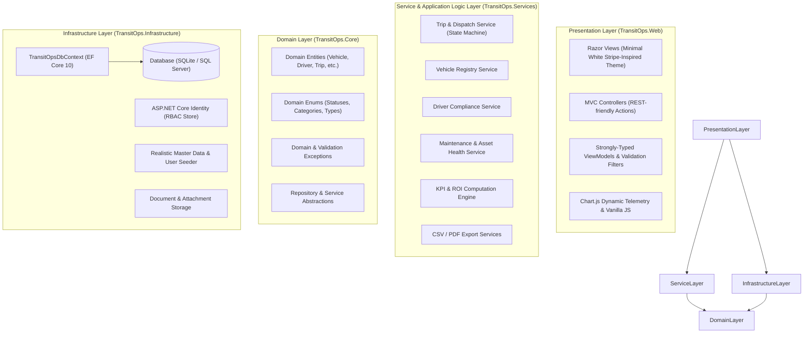
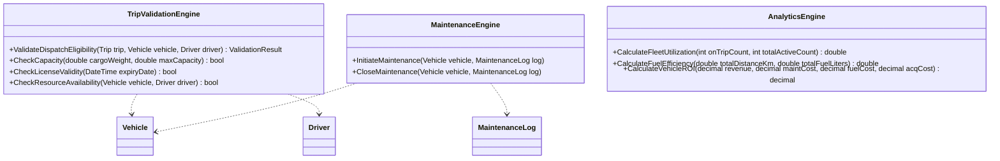

# System Architecture and Technical Design
## Project: TransitOps – Smart Transport Operations Platform

**Document Version:** 1.0  
**Target Framework:** ASP.NET Core 10 (C# 14 / .NET 10 LTS)  
**Architecture Pattern:** Clean Layered Architecture (Domain-Centric)  

---

## 1. Architectural Philosophy & Overview
TransitOps is designed as a modular, maintainable, and high-performance web application utilizing **ASP.NET Core 10**. The system enforces strict separation of concerns, transactional integrity, and strong domain modeling to guarantee that business rules (e.g. payload limitations, driver license validation, automated status transitions) cannot be bypassed.



---

## 2. Project Layer Breakdown

### 2.1 `TransitOps.Core` (Domain Layer)
- **Zero external dependencies** (pure C# standard library).
- Contains:
  - **Entities**: `Vehicle`, `Driver`, `Trip`, `MaintenanceLog`, `FuelLog`, `Expense`, `VehicleDocument`, `DriverDocument`.
  - **Enums**:
    - `VehicleStatus`: `Available`, `OnTrip`, `InShop`, `Retired`.
    - `DriverStatus`: `Available`, `OnTrip`, `OffDuty`, `Suspended`.
    - `TripStatus`: `Draft`, `Dispatched`, `Completed`, `Cancelled`.
    - `VehicleType`: `Truck`, `Van`, `Bus`, `Trailer`.
    - `LicenseCategory`: `Heavy`, `Medium`, `Light`.
    - `MaintenanceType`: `OilChange`, `BrakeInspection`, `EngineOverhaul`, `TireReplacement`, `GeneralService`.
    - `ExpenseType`: `Toll`, `Maintenance`, `Permit`, `Insurance`, `Parking`, `Other`.
    - `MaintenanceStatus`: `InProgress`, `Completed`, `Cancelled`.
  - **Custom Domain Exceptions**: `PayloadExceededException`, `DriverLicenseExpiredException`, `ResourceNotAvailableException`, `InvalidStatusTransitionException`.

### 2.2 `TransitOps.Infrastructure` (Data & External Services)
- References `TransitOps.Core` and Microsoft Entity Framework Core packages.
- Contains:
  - `TransitOpsDbContext`: Configures table names, primary keys, relationships, cascades, indexes, and precision constraints (e.g. decimal precision for costs and revenues).
  - `ApplicationUser` & `ApplicationRole`: Custom Identity classes extending `IdentityUser` and `IdentityRole`.
  - `DatabaseSeeder`: Automatically provisions all 5 user roles, mock vehicles, drivers, trips, fuel logs, and maintenance records on first boot.
  - `CsvExportService`: Implemented with `CsvHelper` for high-throughput streaming CSV exports.
  - `PdfExportService`: Generates clean, printable PDF operational reports.

### 2.3 `TransitOps.Services` (Application Business Logic)
- Implements core business interfaces:
  - `ITripService`: Validates vehicle capacity, driver license status, and manages two-way status transitions on dispatch, cancellation, and check-in.
  - `IVehicleService`: Handles registry CRUD, document uploads, and odometer updates.
  - `IDriverService`: Handles driver profiles, license verification, and safety scores.
  - `IMaintenanceService`: Manages service work orders and auto-locking vehicle status to `InShop`.
  - `IAnalyticsService`: Computes KPIs, Fleet Utilization, Fuel Efficiency, Cost-per-KM, and per-vehicle ROI.

### 2.4 `TransitOps.Web` (Presentation & Web Layer)
- ASP.NET Core 10 Web Application.
- Contains:
  - MVC Controllers (`HomeController`, `DashboardController`, `VehiclesController`, `DriversController`, `TripsController`, `MaintenanceController`, `ExpensesController`, `ReportsController`, `AccountController`).
  - Razor Views with partials for reusable cards, tables, badges, and modals.
  - Modern Design System: Responsive layout, Stripe-inspired minimal white CSS variables, mobile drawer navigation, live search filters, and interactive Chart.js dashboards.

---

## 3. Core Business Validation Engine Architecture



---

## 4. Transactional Integrity & Concurrency
All state transitions that modify multiple database entities (e.g. dispatching a trip updates `Trip.Status = Dispatched`, `Vehicle.Status = OnTrip`, and `Driver.Status = OnTrip`) are wrapped inside EF Core Database Execution Transactions:

```csharp
using var transaction = await _dbContext.Database.BeginTransactionAsync();
try
{
    trip.Status = TripStatus.Dispatched;
    vehicle.Status = VehicleStatus.OnTrip;
    driver.Status = DriverStatus.OnTrip;
    
    await _dbContext.SaveChangesAsync();
    await transaction.CommitAsync();
}
catch
{
    await transaction.RollbackAsync();
    throw;
}
```

This guarantees zero data drift or partial state corruptions during concurrent operations.
