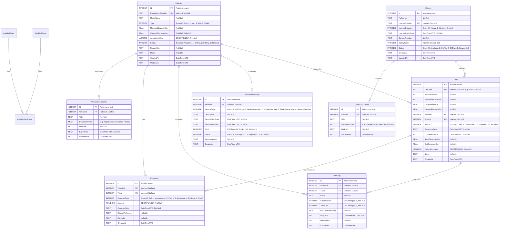

# Database Schema and Entity-Relationship Specification
## Project: TransitOps – Smart Transport Operations Platform

**Document Version:** 1.0  
**Database Engine:** SQLite (Dev/Test) / SQL Server (Production)  
**ORM:** Entity Framework Core 10  

---

## 1. Entity-Relationship (ER) Diagram

---

## 2. Table Definitions & Constraints

### 2.1 Table: `Vehicles`
| Column | Type | Constraints | Description |
|---|---|---|---|
| `Id` | `int` | Primary Key, Identity | Unique Vehicle Identifier |
| `RegistrationNumber` | `nvarchar(50)` | Unique, Indexed, Not Null | Official license plate / registration number |
| `ModelName` | `nvarchar(100)` | Not Null | Vehicle brand and model (e.g. Volvo FH16, Ford Transit) |
| `Type` | `int` | Not Null | 0: Truck, 1: Van, 2: Bus, 3: Trailer |
| `MaxLoadCapacityKg` | `float` | Not Null, Check $>0$ | Maximum allowable cargo payload in kg |
| `CurrentOdometerKm` | `float` | Not Null, Default 0 | Current total odometer reading |
| `AcquisitionCost` | `decimal(18,2)` | Not Null, Check $\ge 0$ | Original asset purchase price |
| `Status` | `int` | Not Null | 0: Available, 1: OnTrip, 2: InShop, 3: Retired |
| `RegionHub` | `nvarchar(100)` | Not Null | Operating depot/hub location |
| `Notes` | `nvarchar(500)` | Nullable | General notes or asset specifications |
| `CreatedAt` | `datetime2` | Not Null | Record creation timestamp |
| `UpdatedAt` | `datetime2` | Nullable | Last modification timestamp |

### 2.2 Table: `Drivers`
| Column | Type | Constraints | Description |
|---|---|---|---|
| `Id` | `int` | Primary Key, Identity | Unique Driver Identifier |
| `FullName` | `nvarchar(150)` | Not Null | Full legal name of driver |
| `LicenseNumber` | `nvarchar(50)` | Unique, Indexed, Not Null | Official government driver license ID |
| `LicenseCategory` | `int` | Not Null | 0: Heavy, 1: Medium, 2: Light |
| `LicenseExpiryDate` | `datetime2` | Not Null | Expiration date of driving license |
| `ContactNumber` | `nvarchar(30)` | Not Null | Primary phone number |
| `SafetyScore` | `int` | Not Null, Range [0, 100] | Driver performance & safety rating |
| `Status` | `int` | Not Null | 0: Available, 1: OnTrip, 2: OffDuty, 3: Suspended |
| `CreatedAt` | `datetime2` | Not Null | Record creation timestamp |
| `UpdatedAt` | `datetime2` | Nullable | Last modification timestamp |

### 2.3 Table: `Trips`
| Column | Type | Constraints | Description |
|---|---|---|---|
| `Id` | `int` | Primary Key, Identity | Unique Trip Identifier |
| `TripCode` | `nvarchar(50)` | Unique, Indexed, Not Null | Human-readable code (e.g. `TRP-2026-0042`) |
| `SourceLocation` | `nvarchar(200)` | Not Null | Origin depot / pickup address |
| `DestinationLocation` | `nvarchar(200)` | Not Null | Delivery destination address |
| `CargoWeightKg` | `float` | Not Null, Check $>0$ | Actual weight of cargo for this dispatch |
| `PlannedDistanceKm` | `float` | Not Null, Check $>0$ | Estimated travel distance |
| `VehicleId` | `int` | FK $\rightarrow$ `Vehicles(Id)`, Not Null | Assigned transport vehicle |
| `DriverId` | `int` | FK $\rightarrow$ `Drivers(Id)`, Not Null | Assigned licensed driver |
| `Status` | `int` | Not Null | 0: Draft, 1: Dispatched, 2: Completed, 3: Cancelled |
| `DepartureTime` | `datetime2` | Nullable | Timestamp when trip changed to `Dispatched` |
| `CompletionTime` | `datetime2` | Nullable | Timestamp when trip completed |
| `StartOdometerKm` | `float` | Nullable | Vehicle odometer at dispatch time |
| `EndOdometerKm` | `float` | Nullable | Vehicle odometer upon delivery |
| `FreightRevenue` | `decimal(18,2)` | Not Null, Default 0 | Revenue billed/earned for this transport run |
| `Notes` | `nvarchar(500)` | Nullable | Consignment notes or delivery instructions |
| `CreatedAt` | `datetime2` | Not Null | Record creation timestamp |

### 2.4 Table: `MaintenanceLogs`
| Column | Type | Constraints | Description |
|---|---|---|---|
| `Id` | `int` | Primary Key, Identity | Unique Maintenance Record ID |
| `VehicleId` | `int` | FK $\rightarrow$ `Vehicles(Id)`, Not Null | Serviced vehicle |
| `ServiceType` | `int` | Not Null | 0: OilChange, 1: BrakeInspection, 2: EngineOverhaul, 3: TireReplacement, 4: GeneralService |
| `Description` | `nvarchar(500)` | Not Null | Detailed work order description |
| `ServiceStartDate` | `datetime2` | Not Null | Date vehicle entered workshop |
| `ServiceEndDate` | `datetime2` | Nullable | Date maintenance was finalized |
| `Cost` | `decimal(18,2)` | Not Null, Default 0 | Total invoice cost of service |
| `Status` | `int` | Not Null | 0: InProgress, 1: Completed, 2: Cancelled |
| `ServiceVendor` | `nvarchar(150)` | Not Null | Workshop / authorized service provider |
| `CreatedAt` | `datetime2` | Not Null | Record creation timestamp |

### 2.5 Table: `FuelLogs`
| Column | Type | Constraints | Description |
|---|---|---|---|
| `Id` | `int` | Primary Key, Identity | Unique Fuel Log ID |
| `VehicleId` | `int` | FK $\rightarrow$ `Vehicles(Id)`, Not Null | Vehicle refueled |
| `TripId` | `int` | FK $\rightarrow$ `Trips(Id)`, Nullable | Linked trip (if refueled during trip) |
| `Liters` | `float` | Not Null, Check $>0$ | Fuel quantity in liters |
| `CostPerLiter` | `decimal(18,2)` | Not Null | Fuel unit price |
| `TotalCost` | `decimal(18,2)` | Not Null | Total transaction cost (`Liters * CostPerLiter`) |
| `OdometerReading` | `float` | Not Null | Vehicle odometer at refueling |
| `LogDate` | `datetime2` | Not Null | Date of fueling |
| `GasStation` | `nvarchar(150)` | Nullable | Fuel vendor / station location |
| `CreatedAt` | `datetime2` | Not Null | Record creation timestamp |

### 2.6 Table: `Expenses`
| Column | Type | Constraints | Description |
|---|---|---|---|
| `Id` | `int` | Primary Key, Identity | Unique Expense ID |
| `VehicleId` | `int` | FK $\rightarrow$ `Vehicles(Id)`, Nullable | Linked vehicle |
| `TripId` | `int` | FK $\rightarrow$ `Trips(Id)`, Nullable | Linked trip |
| `ExpenseType` | `int` | Not Null | 0: Toll, 1: Maintenance, 2: Permit, 3: Insurance, 4: Parking, 5: Other |
| `Amount` | `decimal(18,2)` | Not Null, Check $>0$ | Expense amount |
| `ExpenseDate` | `datetime2` | Not Null | Date expense was incurred |
| `ReceiptReference`| `nvarchar(100)` | Nullable | Receipt / invoice number |
| `Remarks` | `nvarchar(500)` | Nullable | Expense justification |
| `CreatedAt` | `datetime2` | Not Null | Record creation timestamp |
