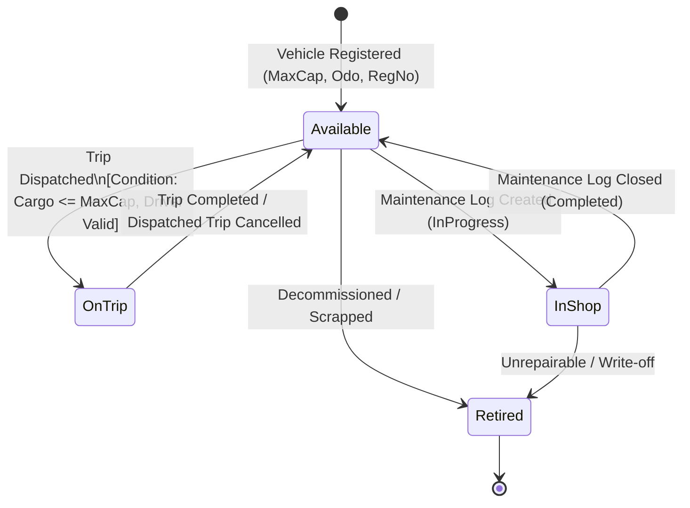
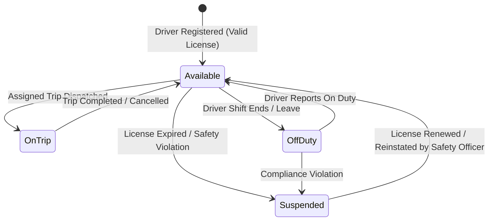
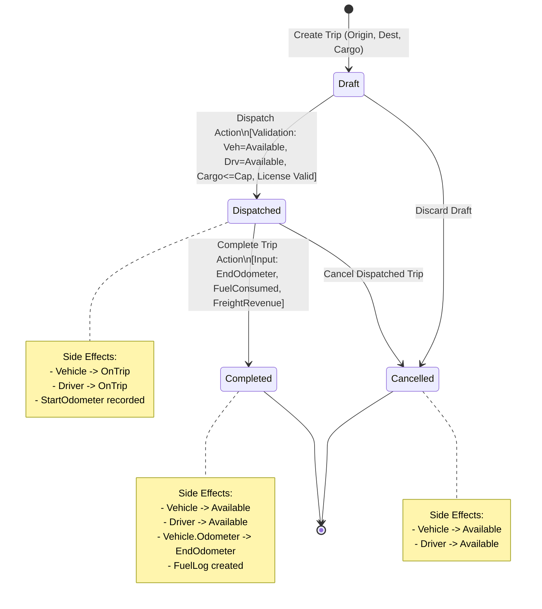
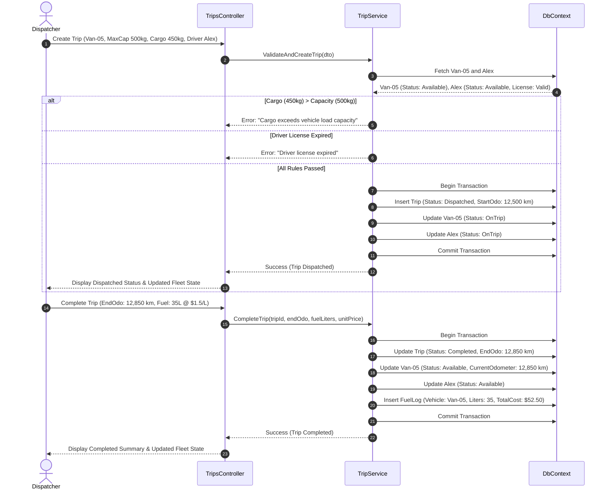
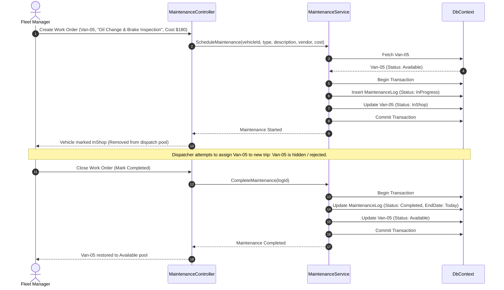
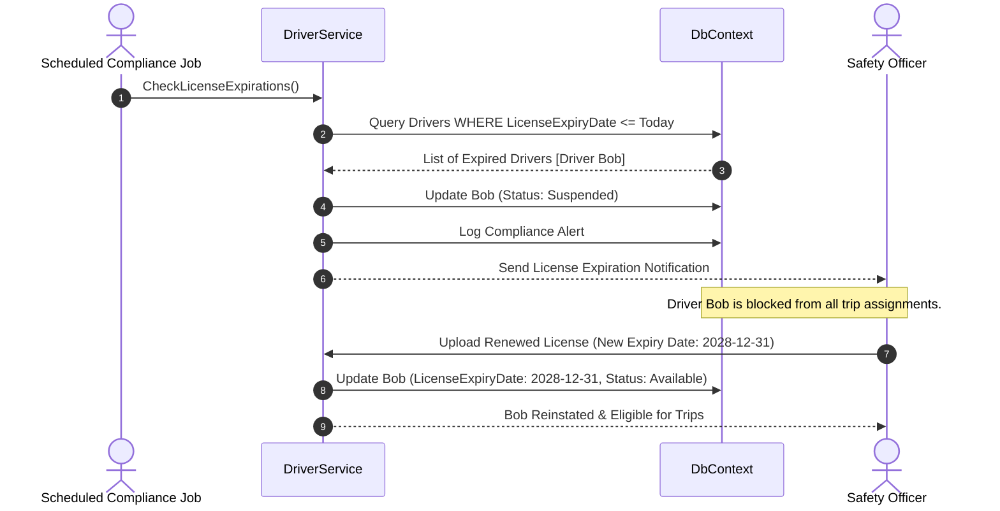

# Workflows and State Machines Specification
## Project: TransitOps – Smart Transport Operations Platform

**Document Version:** 1.0  
**Status:** Approved Specification  

---

## 1. Core State Machines

### 1.1 Vehicle Lifecycle State Machine

### 1.2 Driver Operational & Compliance State Machine

### 1.3 Trip Lifecycle State Machine

---

## 2. End-to-End Sequence Workflows

### 2.1 Workflow 1: End-to-End Trip Dispatch & Completion

---

### 2.2 Workflow 2: Preventive Maintenance & Asset Protection

---

### 2.3 Workflow 3: Driver License Expiry & Proactive Suspension

