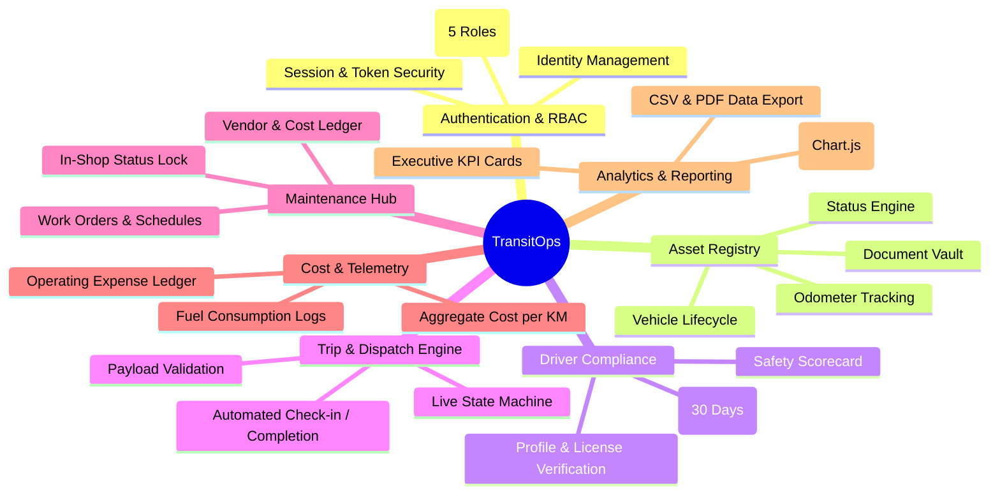

# Product Requirements Document (PRD)
## Project: TransitOps — Smart Transport Operations Platform

**Document Version:** 1.0
**Status:** Approved Specification
**Technology Base:** ASP.NET Core 10, EF Core, MVC with Vanilla Modern UI
**Target Release:** Q3 2026

---

## 1. Executive Summary

### 1.1 Problem Statement

Modern logistics and fleet companies frequently struggle with manual spreadsheets, disconnected paper logbooks, and disjointed communication channels. This results in:

- High frequency of double-booking vehicles and drivers.
- Overloaded vehicles causing safety violations, mechanical breakdowns, and traffic penalties.
- Drivers operating with expired licenses or poor compliance histories.
- Delayed maintenance leading to catastrophic asset downtime and reduced vehicle lifecycle.
- Lack of operational visibility, inaccurate fuel/maintenance expense tracking, and missing vehicle Return-on-Investment (ROI) analytics.

### 1.2 Product Vision

**TransitOps** is an all-in-one, intelligent transport operations management platform designed to automate and streamline the full operational lifecycle of fleet vehicles, driver compliance, trip dispatching, preventive maintenance, fuel and expense monitoring, and business analytics.

TransitOps empowers fleet organizations to achieve:

- **Zero dispatch scheduling conflicts** via automated state locking.
- **100% compliance** with driver licensing and vehicle payload limits.
- **Maximized fleet utilization** and proactive maintenance scheduling.
- **Granular cost tracking** and accurate per-vehicle ROI calculations.

---

## 2. Target Personas & Stakeholders

| Persona | Role | Core Goals | Pain Points |
|---|---|---|---|
| **Marcus Vance** | Fleet Manager | Maintain optimal vehicle health, track asset lifecycles, ensure preventive servicing, maximize fleet uptime. | Unplanned breakdowns, vehicles missing service intervals, lack of asset visibility. |
| **Dave Miller** | Dispatcher / Operations | Quickly assign available drivers and vehicles to deliveries, track active trips, verify cargo load limits. | Accidental double-booking, assigning overloaded vehicles, manual route calculations. |
| **Samantha Ray** | Safety & Compliance Officer | Ensure 100% driver compliance, track license expiration dates, enforce safety scoring. | Tracking expiring driver licenses on paper, missing safety violations. |
| **Elena Rostova** | Financial Analyst | Track operational costs (fuel + maintenance + tolls), compute per-vehicle ROI, export analytical reports. | Missing fuel receipts, opaque maintenance costs, lack of financial ROI calculations. |
| **Arthur Pendelton** | System Administrator | Control platform access, manage user roles, maintain audit trails, ensure system security. | Complex user provisioning, lack of role segregation. |

---

## 3. Product Goals & Business KPIs

### 3.1 Primary Success Metrics

1. **Fleet Utilization Rate**
   $$\text{Utilization (\%)} = \left( \frac{\text{Active Vehicles on Trip}}{\text{Total Fleet Size} - \text{Retired Vehicles}} \right) \times 100$$
   *Target: > 75% average utilization.*

2. **Dispatch Error Rate** — *Target: 0%* (strictly enforced by the automated validation state engine).

3. **Driver Compliance Rate** — *Target: 100%* (zero tolerance for expired licenses on active trips).

4. **Fuel Efficiency Ratio**
   $$\text{Fuel Efficiency (km/L)} = \frac{\text{Distance (km)}}{\text{Fuel Consumed (Liters)}}$$

5. **Vehicle ROI Visibility**
   $$\text{Vehicle ROI (\%)} = \left( \frac{\text{Freight Revenue} - (\text{Maintenance Cost} + \text{Fuel Cost})}{\text{Vehicle Acquisition Cost}} \right) \times 100$$

---

## 4. Roles & Role-Based Access Control

The platform supports **5 standard roles**. A detailed permission matrix is maintained in the RBAC specification.

| Role | Responsibility |
|---|---|
| **Admin** | Superuser — full access across all modules and user management. |
| **Fleet Manager** | Assets & maintenance: full vehicle CRUD, maintenance work orders, fleet health views. |
| **Dispatcher** | Trips: create/dispatch/complete/cancel trips, log trip fuel & expenses. |
| **Safety Officer** | Driver compliance: driver CRUD, license/safety management, suspensions. |
| **Financial Analyst** | Costs: fuel/expense ledgers, ROI analytics, CSV/PDF export. |

---

## 5. Feature Epics & Scope

### Epic 1: Identity, Authentication & Role-Based Access Control
- Secure login, password hashing, and session management via ASP.NET Core Identity.
- Role-based authorization policies for `Admin`, `FleetManager`, `Dispatcher`, `SafetyOfficer`, `FinancialAnalyst`.
- Unauthenticated requests redirect to the login portal; unauthorized access returns 403 with a friendly error view.

### Epic 2: Vehicle Master Registry & Document Vault
- Full lifecycle tracking: registration plate (globally unique), model, type (`Truck`, `Van`, `Bus`, `Trailer`), max payload capacity (kg), current odometer, acquisition cost, hub/region.
- Real-time status states: `Available`, `OnTrip`, `InShop`, `Retired`.
- Search, filter by type/status/region, and sort.
- Upload and manage vehicle documents (Insurance, Fitness Certificate, RC).

### Epic 3: Driver Profile & Compliance Tracking
- Driver repository: name, license number (unique), category (`Heavy`, `Medium`, `Light`), expiry date, contact info, safety score (0–100).
- Automatic status management: `Available`, `OnTrip`, `OffDuty`, `Suspended`.
- Proactive expiration warning dashboard for licenses expiring within 30 days; expired licenses trigger red/expired indicators and dispatch locks.

### Epic 4: Smart Trip Dispatch & State Engine *(Core Value)*
- Trip planning: source, destination, cargo weight, planned distance, freight revenue, assigned vehicle, assigned driver.
- Pre-dispatch business validations: payload limit, vehicle/driver availability, license validity.
- Automatic dual-entity status transitions (`Available` → `OnTrip` → `Available`).
- Trip check-in / completion flow: final odometer entry, fuel consumed calculation, revenue reconciliation.
- Dispatch and completion updates are transactional (no partial state corruption).

### Epic 5: Preventive Maintenance & Service Logs
- Create and manage service work orders (`Oil Change`, `Brake Inspection`, `Engine Overhaul`, `Tire Replacement`, `General Service`).
- Automatic status locking: vehicle switches to `InShop` upon active maintenance creation and is hidden from dispatch dropdowns.
- Automatic release: restores vehicle to `Available` upon service completion (unless `Retired`).
- Maintenance cost is automatically logged into the vehicle's operational expense ledger.

### Epic 6: Fuel Logging & Expense Tracking
- Log fuel transactions: liters, cost per liter, total cost, odometer reading, gas station name.
- Track ancillary expenses: tolls, permits, parking, insurance, routine repairs.
- Automated calculation of total operating cost per vehicle:
  $$\text{Total Operational Cost} = \sum \text{Fuel Costs} + \sum \text{Maintenance Costs} + \sum \text{Other Expenses}$$

### Epic 7: Executive Operations Dashboard & Analytics
- Live KPI cards: Active Vehicles, Available Vehicles, Vehicles In Maintenance, Active Trips, Pending Trips, Drivers On Duty, Fleet Utilization (%).
- Filtering by vehicle type, status, and hub region.
- Visual charts: monthly expense breakdown (fuel vs. maintenance vs. tolls), fleet health status donut, driver safety score distribution.
- One-click CSV and formatted PDF report export.

### Epic 8: Reports & ROI Analytics
- Per-vehicle ROI table: acquisition cost, freight revenue, fuel cost, maintenance cost, net profit, ROI (%).
- Fuel efficiency matrix per vehicle class.
- Export toolbar: `Export to CSV` and `Generate Executive PDF Report`.

---

## 6. Mandatory Business Rules

1. **Unique Vehicle Registration** — every registration plate must be strictly unique.
2. **Dispatch Vehicle Pool** — vehicles marked `Retired` or `InShop` must never appear in trip assignment dropdowns.
3. **Driver Compliance** — drivers with expired licenses or `Suspended`/`OffDuty` status cannot be assigned to trips.
4. **No Double Booking** — a vehicle or driver currently `OnTrip` cannot be assigned to another trip.
5. **Payload Limit Validation** — cargo weight ≤ vehicle maximum load capacity.
6. **Automatic Dispatch Transition** — dispatching a trip switches both Vehicle and Driver status to `OnTrip` and locks the start odometer.
7. **Automatic Completion Transition** — completing a trip restores Vehicle and Driver to `Available`, updates odometer, and creates a fuel log.
8. **Automatic Cancellation Reversal** — cancelling a dispatched trip immediately restores Vehicle and Driver to `Available`.
9. **Maintenance Status Lock** — creating an active maintenance log automatically switches Vehicle status to `InShop` and removes it from dispatch.
10. **Maintenance Resolution** — completing maintenance restores Vehicle status to `Available` (unless `Retired`).

---

## 7. Non-Functional Requirements

- **Performance:** Dashboard load time < 500 ms; CRUD execution < 200 ms; read-only queries use `AsNoTracking()`; indexed foreign keys and registration numbers.
- **Security:** Anti-CSRF protection, input sanitation, PBKDF2 password encryption, transactional consistency during multi-entity state transitions.
- **Availability & Resilience:** ACID transactional guarantees on all state transitions.
- **Aesthetics & Usability:** Modern minimal white UI (Stripe-inspired) with clean white cards, color-coded status badges, fully responsive across mobile, tablet, and widescreen desktop.

---

## 8. Out of Scope (v1)

- Payment/invoicing gateway integration.
- Mobile native apps (responsive web UI covers v1).
- Multi-tenant SaaS hosting.

## 9. Future Features (Roadmap)

These are deferred beyond v1 and must **not** be included in the phase-1 wireframes (design only what v1 can build):

- **Slide-over inspection drawer** — right-side detail panel for entities (replaced in v1 by full detail pages).
- **Ctrl+K command palette** — global spotlight search (replaced in v1 by per-page search + filters).
- **Live real-time telemetry (SignalR)** — push-based live updates; v1 uses page refresh / AJAX polling and shows current data.
- **GPS live-tracking & external map/routing APIs** — v1 records route manually; no map views.
- Real-time notification push to the browser.

## 10. Acceptance Criteria (Verification Targets)

| ID | Scenario | Expected Outcome |
|---|---|---|
| AC-01 | Register vehicle with duplicate registration number | Rejected with unique constraint validation error. |
| AC-02 | Dispatch trip with cargo exceeding vehicle capacity | Blocked with overload alert. |
| AC-03 | Dispatch trip with driver whose license expired | Blocked with license expired error. |
| AC-04 | Dispatch a valid trip | Trip becomes `Dispatched`; vehicle and driver become `OnTrip`. |
| AC-05 | Complete a dispatched trip with final odometer | Trip `Completed`; vehicle/driver restored to `Available`; odometer updated; fuel log created. |
| AC-06 | Create active maintenance log for a vehicle | Vehicle becomes `InShop` and disappears from dispatch dropdown. |
| AC-07 | Mark maintenance log as completed | Vehicle restored to `Available` and reappears in dispatch dropdown. |
| AC-08 | Verify dashboard Fleet Utilization & ROI calculations | Calculations precisely match domain formulas. |
| AC-09 | Export analytics report to CSV / PDF | File downloads successfully with complete dataset. |